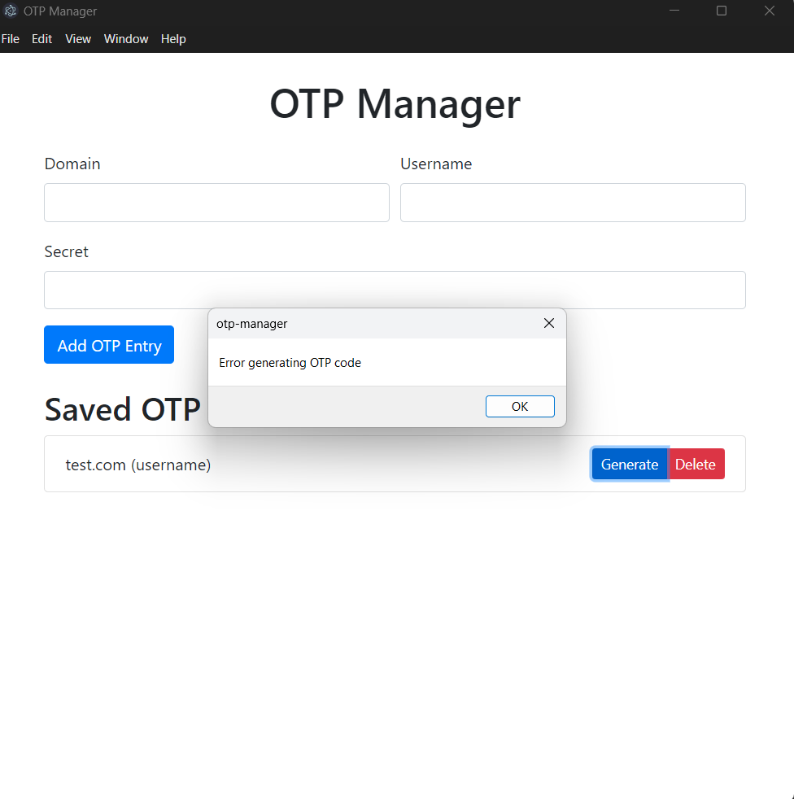

# OTP Manager

OTP Manager is a desktop application built using Electron that securely manages One-Time Password (OTP) entries. This app allows users to add, generate, and delete OTP entries for various domains and usernames. The entries are securely stored in an encrypted JSON file using a master password.

## Features

- Add OTP entries with domain, username, and secret.
- Generate OTP codes based on the stored secret.
- Delete OTP entries.
- Securely store OTP entries using AES-256-GCM encryption.
- Master password prompt on application startup to decrypt and load OTP entries.
- User-friendly interface with Bootstrap styling.

## Prerequisites

- Node.js (>=14.x)
- npm (>=6.x)

## Installation

1. **Clone the repository:**
   ```bash
   git clone https://github.com/your-username/otp-manager.git
   cd otp-manager
   ```

2. **Install dependencies:**
   ```bash
   npm install
   ```

## Development

To start the application in development mode with hot reload:

```bash
npm run dev
```

## Production Build

To create a production build:

```bash
npm run build
```

## Usage

### Adding OTP Entries

1. Open the application.
2. Enter your master password when prompted.
3. Fill in the domain, username, and secret fields in the form.
4. Click the "Add OTP Entry" button.

### Generating OTP Codes

1. Click the "Generate" button next to the desired OTP entry.
2. An alert will display the generated OTP code.

### Deleting OTP Entries

1. Click the "Delete" button next to the OTP entry you wish to delete

